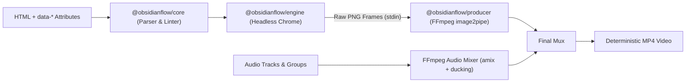

<p align="center">
  <br />
  
  <h1 align="center">OBSIDIAN FLOW</h1>
  <p align="center">
    <strong>Deterministic AI-Native Video Rendering Engine from HTML &amp; CSS</strong>
  </p>
</p>

<p align="center">
  <a href="https://www.npmjs.com/package/obsidianflow"></a>
  <a href="https://github.com/btsstudios/obsidianflow/releases"></a>
  <a href="https://github.com/btsstudios/obsidianflow/blob/main/LICENSE"></a>
  
  <a href="https://discord.gg/dgwcQrmqF"></a>
  <a href="#-install-ai-agent-skills"></a>
</p>

<p align="center">
  <strong>Write HTML. Render video. Built for the agent era.</strong>
</p>

<p align="center">
  <code>$ npx skills add btsstudios/obsidianflow --full-depth</code>
</p>

<p align="center">
  <a href="#-install-ai-agent-skills">Agent Skills</a> •
  <a href="#-quickstart">Quickstart</a> •
  <a href="#-video-creation">Video Creation</a> •
  <a href="#-the-composition-format">Format</a> •
  <a href="#-cli-commands">CLI</a> •
  <a href="#-static-linter-rules-of001---of039">Linter</a> •
  <a href="https://discord.gg/dgwcQrmqF">Discord</a>
</p>

<p align="center">
  
</p>

---

## 🤖 Install AI Agent Skills

Let AI agents compose deterministic videos by writing code. Install the official **OBSIDIAN FLOW** skills into your AI coding assistant (**Claude Code**, **Cursor**, **Antigravity**, **Windsurf**, **GitHub Copilot**, **Cline**, **OpenHands**) with one command:

```bash
npx skills add btsstudios/obsidianflow --full-depth
```

Or install directly via the OBSIDIAN FLOW CLI:

```bash
npx obsidianflow skill install
```

| Skill | Description |
| :--- | :--- |
| **`obsidianflow`** | Master skill for autonomous video generation, HTML/CSS layout, deterministic animations & render commands |
| **`obsidianflow-core`** | Composition AST, timing attributes (`data-*`), seekable master clocks, and frame adapters |
| **`obsidianflow-audio`** | Multi-track audio mixing, FFmpeg sidechain dialogue ducking, and volume curves |

---

## 🌟 Video Creation in the Agent Era

OBSIDIAN FLOW is an open-source, AI-native framework for turning standard web technologies (HTML, CSS, SVG, WebGL, animations) into deterministic, frame-accurate MP4 videos.

- **Make videos agentically**: LLMs author HTML and CSS natively. AI coding agents (Claude, Cursor, Antigravity) script, animate, and generate complete video productions using built-in agent skills.
- **Render deterministically**: Frame-by-frame timeline seeking via headless Chrome and direct FFmpeg `image2pipe` streaming. No dropped frames, no wall-clock timing jitter.
- **Compose with standard web tech**: Use CSS keyframes, SVG, WebGL, and seekable timelines (Native, GSAP, WAAPI) with simple HTML `data-*` attributes.
- **Validate before rendering**: Over 30 static analysis checks catch timing overflows, non-deterministic timers, and missing media before invoking the renderer.

---

## ⚔️ Why OBSIDIAN FLOW?

A direct comparison of how **OBSIDIAN FLOW** improves upon existing programmatic video rendering solutions:

| Capability | **OBSIDIAN FLOW** 🌋 | **Remotion** ⚛️ | **HeyGen HyperFrames** ⚡ |
| :--- | :--- | :--- | :--- |
| **Composition Language** | **Native HTML5 + `data-*`**<br>*(Zero framework lock-in)* | React JSX only<br>*(Requires learning custom components)* | HTML + GSAP timeline |
| **AI Agent Native** | **100% Native**<br>*(LLMs write raw HTML & CSS naturally)* | Complex<br>*(LLM must learn Remotion React hooks)* | Script + GSAP timeline |
| **Rendering Core** | **Headless Chrome + direct FFmpeg pipe**<br>*(Deterministic frame-by-frame streaming)* | Headless Chrome + React frame step | Headless Chrome + FFmpeg |
| **Animation Engines** | **Multi-Adapter**:<br>• Native Keyframes (0 deps)<br>• GSAP Timeline<br>• Web Animations API (WAAPI)<br>• Three.js | React state & `useCurrentFrame()` only | GSAP timeline only |
| **Audio Mixing & Ducking** | **Built-in FFmpeg sidechain ducking**<br>*(Auto-ducks music under dialogue)* | Manual `<Audio>` components<br>*(No built-in ducking)* | Audio filtergraph |
| **Pre-Render Linter** | **30+ Static Checks (OF001–OF039)**<br>*(Timing, determinism, media, codecs)* | None built-in<br>*(Errors caught during render)* | Static checks |
| **Agent CLI Interop** | **Full `--json` on all commands**<br>*(Machine-readable for coding agents)* | Human-focused CLI | Developer CLI |
| **Open Source License** | **Apache 2.0**<br>*(100% Free for commercial & enterprise use)* | **Restrictive Company License**<br>*(Paid license required for teams > 3)* | Apache 2.0 |
| **Collaboration Ready** | **Firestore Real-time CRDT Sync**<br>*(Built for multiplayer video editing)* | Local dev preview | Local audit player |

---

## 🏛 Monorepo Architecture

```
/home/b1337/Desktop/OBSIDIAN_FLOW/
├── packages/
│   ├── core/                    # @obsidianflow/core
│   │   ├── types.ts             # Composition, Clip, Track, FrameAdapter types
│   │   ├── parser.ts            # HTML AST parser with jsdom
│   │   ├── linter.ts            # 30+ static checks (OF001-OF039)
│   │   ├── runtime.ts           # Browser runtime & window.__obsidianflow clock
│   │   ├── time.ts              # Timecode & string parsing
│   │   └── adapters/            # Seekable frame adapters (Native, GSAP, WAAPI)
│   │
│   ├── engine/                  # @obsidianflow/engine
│   │   ├── browser.ts           # Headless Chrome launcher & lifecycle
│   │   └── capture.ts           # Deterministic frame-by-frame capture loop
│   │
│   ├── producer/                # @obsidianflow/producer
│   │   ├── pipeline.ts          # Orchestrated render pipeline
│   │   ├── encoder.ts           # FFmpeg video encoding via stdin image2pipe
│   │   └── audio-mixer.ts       # Multi-track audio mixer with ducking
│   │
│   └── cli/                     # obsidianflow CLI
│       ├── cli.ts               # Commander entry point
│       └── commands/            # init, lint, check, render
│
├── templates/
│   ├── blank/                   # Minimal 1080p 10s composition
│   └── short-drama/             # Multi-scene AI drama with dialogue and transitions
│
└── skills/                      # AI Agent Skills (Claude, Cursor, Antigravity)
    ├── obsidianflow-core/       # Composition authoring skill
    └── obsidianflow-audio/      # Multi-track audio and ducking skill
```



---

## 🚀 Quickstart

### 1. Installation & Build

```bash
# Clone the repository
git clone https://github.com/btsstudios/obsidianflow.git
cd obsidianflow

# Install dependencies and build all packages
npm install
npm run build
```

### 2. Scaffold a New Video Project

```bash
npx obsidianflow init my-video --template blank
cd my-video
```

### 3. Check & Lint Composition

```bash
# Quick structure and timing check
npx obsidianflow check ./index.html

# Run 30+ static analysis lint rules
npx obsidianflow lint ./index.html
```

### 4. Render to MP4

```bash
npx obsidianflow render ./index.html -o final.mp4 --fps 30 --bitrate 10M
```

---

## 📝 The Composition Format

Compositions are standard HTML files annotated with `data-*` attributes:

```html
<!DOCTYPE html>
<html
  lang="en"
  data-composition-id="scene-01"
  data-width="1920"
  data-height="1080"
  data-fps="30"
  data-duration="10s"
>
<head>
  <meta charset="utf-8" />
  <link rel="stylesheet" href="styles.css" />
  <script src="@obsidianflow/core/runtime.js"></script>
</head>
<body>
  <!-- Video / Graphic Clip -->
  <div class="clip" id="intro" data-start="0s" data-duration="5s" data-track="video-1">
    <video
      src="assets/city-rain.mp4"
      data-media-start="0s"
      data-generated-by="veo-3.1"
      data-generation-id="gen_789abc"
    ></video>
    <h1 class="title">NEO TOKYO</h1>
  </div>

  <!-- Volcanic Shader Transition -->
  <of-transition
    type="lava-flow"
    data-start="4.5s"
    data-duration="1s"
    data-from="intro"
    data-to="dialogue-shot"
  ></of-transition>

  <!-- Multi-track Audio with Ducking -->
  <of-audio-group data-fx-chain="compression,reverb">
    <audio
      src="assets/synthwave-theme.mp3"
      data-track="music"
      data-start="0s"
      data-duration="10s"
      data-volume="0.6"
      data-ducking="dialogue"
    ></audio>
    <audio
      src="assets/voiceover.mp3"
      data-track="dialogue"
      data-start="2s"
      data-duration="4s"
      data-volume="1.0"
      data-generated-by="elevenlabs"
    ></audio>
  </of-audio-group>

  <!-- Deterministic Timeline Registration -->
  <script>
    const tl = new window.NativeTimelineAdapter();
    tl.fromTo('.title', { opacity: 0, y: 30 }, { opacity: 1, y: 0, duration: 1.0 }, 0.5);
    window.__obsidianflow.registerTimeline('scene-01', tl);
  </script>
</body>
</html>
```

---

## ⚡ CLI Commands

| Command | Description | Example |
| :--- | :--- | :--- |
| `obsidianflow init <name>` | Scaffold a project from starter templates (`blank`, `short-drama`) | `npx obsidianflow init promo --template short-drama` |
| `obsidianflow lint <file>` | Run 30+ static rules for timing, determinism, and media | `npx obsidianflow lint ./index.html --json` |
| `obsidianflow check <file>` | Inspect composition dimensions, frames, tracks, and metadata | `npx obsidianflow check ./index.html` |
| `obsidianflow render <file>` | Execute headless Chrome capture and FFmpeg encode | `npx obsidianflow render ./index.html -o video.mp4 --fps 30` |

All commands accept `--json` for machine-to-machine communication with AI coding agents.

---

## 🔍 Static Linter Rules (OF001 - OF039)

| Rule ID | Severity | Category | Description |
| :--- | :--- | :--- | :--- |
| `OF001` | Error | Timing | Clip extends beyond composition duration |
| `OF002` | Warning | Timing | Overlapping clips on same track without transition |
| `OF003` | Error | Timing | Negative clip start time |
| `OF004` | Error | Timing | Zero or negative clip duration |
| `OF005` | Warning | Timing | Audio track extends beyond composition duration |
| `OF006` | Error | Timing | Transition duration exceeds connected clip length |
| `OF007` | Error | Timing | Transition start time outside composition bounds |
| `OF008` | Warning | Timing | Audio ducking references non-existent track |
| `OF009` | Error | Timing | Negative media start offset |
| `OF010` | Error | Determinism | `Math.random()` detected (breaks reproducible rendering) |
| `OF011` | Warning | Determinism | `Date.now()` or `new Date()` detected |
| `OF012` | Error | Determinism | `setInterval()` or `setTimeout()` detected |
| `OF013` | Warning | Determinism | `requestAnimationFrame()` loops detected |
| `OF014` | Warning | Determinism | `performance.now()` detected |
| `OF015` | Warning | Determinism | `crypto.getRandomValues()` detected |
| `OF016` | Warning | Determinism | CSS infinite animation without seekable timeline |
| `OF017` | Warning | Determinism | Async `fetch()` or `XMLHttpRequest` inside render loop |
| `OF018` | Warning | Determinism | Missing `window.__timelines` or runtime registration |
| `OF019` | Info | Determinism | DOM `MutationObserver` or `ResizeObserver` detected |
| `OF020` | Warning | Structure | Missing or default `data-composition-id` |
| `OF021` | Error | Structure | Invalid dimensions (must be positive even integers for H.264) |
| `OF022` | Error | Structure | Invalid FPS (must be between 1 and 120) |
| `OF023` | Error | Structure | Invalid or missing `data-duration` |
| `OF024` | Warning | Structure | Missing runtime script inclusion |
| `OF025` | Error | Structure | Malformed JSON in `data-composition-variables` |
| `OF026` | Warning | Structure | Clip missing `data-track` |
| `OF027` | Error | Structure | Duplicate clip IDs found |
| `OF028` | Warning | Structure | Unknown transition type |
| `OF029` | Warning | Structure | Transition references non-existent clip ID |
| `OF030` | Error | Media | Media element missing `src` attribute |
| `OF031` | Error | Media | Local media file does not exist on disk |
| `OF032` | Error | Media | Empty media source `src=""` |
| `OF033` | Warning | Media | Remote media URL with invalid protocol |
| `OF035` | Info | AI Metadata | Clip missing `data-generated-by` AI model tag |
| `OF036` | Info | AI Metadata | Clip missing `data-generation-id` tracking attribute |
| `OF037` | Warning | Media | Audio volume out of `[0.0, 1.0]` range |
| `OF038` | Warning | Media | Unsupported audio extension |
| `OF039` | Warning | Media | Unsupported video extension |

---

## 🤖 AI Agent Skills

OBSIDIAN FLOW includes native skills for AI coding agents (Claude, Cursor, Antigravity, GitHub Copilot):
- [`skills/obsidianflow-core/SKILL.md`](skills/obsidianflow-core/SKILL.md) — Teaches agents composition structure, timing, determinism, and timeline registration.
- [`skills/obsidianflow-audio/SKILL.md`](skills/obsidianflow-audio/SKILL.md) — Teaches agents multi-track audio layering, automated ducking, and sound design.

---

## 📜 License & Attribution

- **License**: Apache 2.0
- **Author**: BIDKAR RAMOS (`bidkar@gulp.wtf`)
- **Organization**: BTS Studios
- **Repository**: [https://github.com/btsstudios/obsidianflow](https://github.com/btsstudios/obsidianflow)
- **Discord**: [https://discord.gg/dgwcQrmqF](https://discord.gg/dgwcQrmqF)
