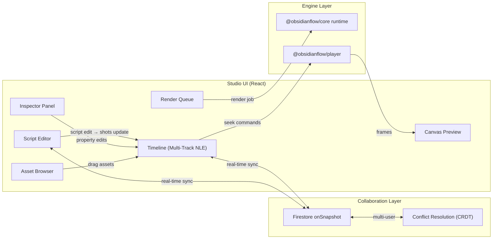
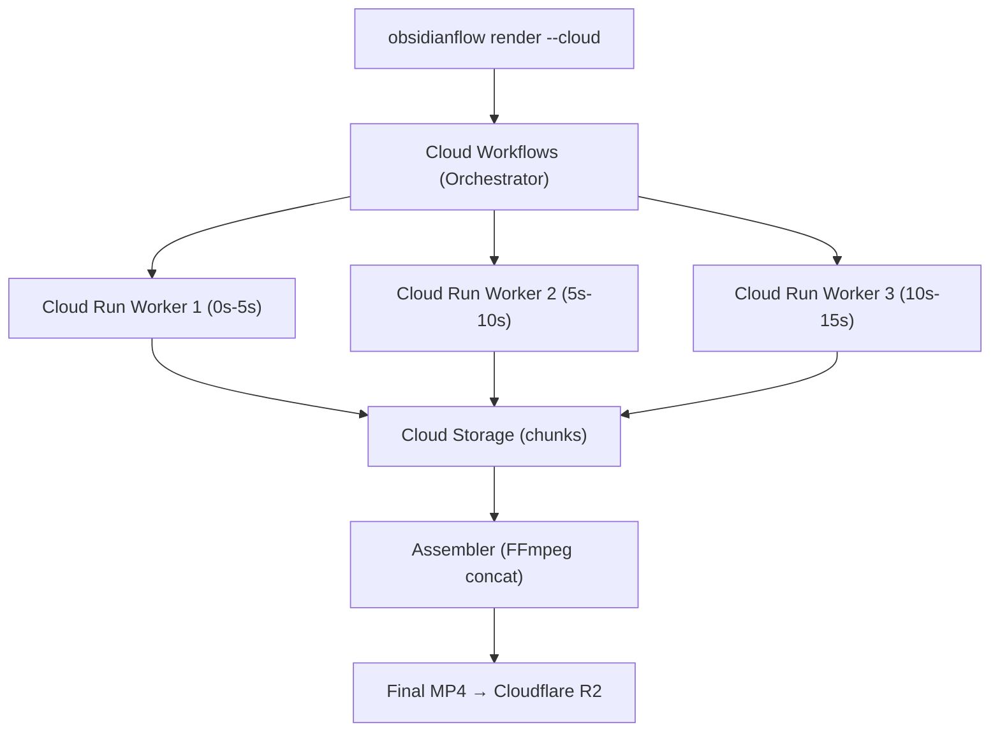

# 🌋 ObsidianFlow — Implementation Plan

> **An open-source, AI-native framework for turning HTML, CSS, media, and seekable animations into deterministic MP4 videos.**
>
> *Inspired by Remotion and HyperFrames. Built for AI agents. Owned by you.*

---

## Goal

Build **ObsidianFlow** — a standalone open-source video rendering framework that:
1. Competes directly with Remotion and HeyGen's HyperFrames
2. Uses HTML/CSS as the composition format (AI-native — LLMs write HTML natively)
3. Runs locally via CLI, from AI agents via skills, or as the rendering core behind Obsidian Video
4. Is fully open-source (Apache 2.0) so anyone can download, use, and contribute
5. Integrates Firestore real-time collaboration and script-driven timelines (Descript insights)

---

## User Review Required

> [!IMPORTANT]
> **Naming Decision**: I'm proposing **ObsidianFlow** as the framework name. Alternatives considered:
> - **LavaFrames** — direct play on HyperFrames, volcanic
> - **MoltenFrames** — lava + frames, punchy
> - **MagmaFlow** — underground power
> - **ObsidianFlow** ← **Recommended** — keeps brand, "flow" = creative flow + lava flow + data flow
>
> npm scope would be `@obsidianflow/*`, repo at `github.com/BTSSTUDIOS/obsidianflow`

> [!IMPORTANT]
> **Separate Repo**: ObsidianFlow should be its own repo (`BTSSTUDIOS/obsidianflow`), not inside the Obsidian web app. The web app (`BTSSTUDIOS/obsidian`) consumes `@obsidianflow/*` packages as dependencies. This is exactly how HeyGen does it — HyperFrames is standalone, HeyGen's product uses it internally.

> [!WARNING]
> **Headless Chrome vs WebCodecs**: HyperFrames chose Puppeteer+FFmpeg over WebCodecs because it lets you use the entire web ecosystem (CSS, SVG, GSAP, Lottie, WebGL) out of the box. This is the right call for production renders. However, we can add WebCodecs as a **second rendering path** for fast browser previews — something HyperFrames doesn't have. This is our competitive advantage.

---

## Open Questions

> [!IMPORTANT]
> 1. **Name**: ObsidianFlow? Or one of the alternatives above?
> 2. **License**: Apache 2.0 (like HyperFrames) or MIT? Apache gives patent protection.
> 3. **Animation Library**: GSAP (industry standard, but has licensing nuances for commercial tools) vs Web Animations API (free, native) vs our own seekable timeline? HyperFrames uses GSAP.
> 4. **Priority**: Build the engine first then the studio? Or build them in parallel?

---

## Competitive Analysis

### What We Learned from HyperFrames

| Area | HyperFrames Does | ObsidianFlow Will Do |
|------|------------------|---------------------|
| **Composition Format** | HTML + `data-*` attributes + GSAP timeline | HTML + `data-*` attributes + seekable timeline (**same approach — it's brilliant**) |
| **Rendering** | Puppeteer + FFmpeg only | **Dual path**: Puppeteer+FFmpeg (production) + WebCodecs (browser preview) |
| **Audio** | FFmpeg `amix` with ducking, EQ, compression chains | Same + **Web Audio API** for real-time preview mixing |
| **Transitions** | 14 WebGL shader transitions | WebGL shaders + **CSS transitions** (broader ecosystem) |
| **Editor** | React Studio (audit/tweak only, not full NLE) | **Full NLE** with timeline, clip drag, keyframes |
| **Player** | `<hyperframes-player>` web component (iframe-based) | `<obsidianflow-player>` web component (**same approach**) |
| **Cloud Render** | AWS Lambda + Step Functions + S3 | **Google Cloud Run + Workflows + Cloud Storage** |
| **Collaboration** | ❌ None | ✅ **Firestore real-time sync** (killer feature) |
| **Script-Driven** | ❌ Manual composition | ✅ **Script → Shot → Timeline** (Descript paradigm) |
| **AI Generation** | ❌ No built-in video gen | ✅ **MuAPI/Veo/Kling integration** |
| **Agent Skills** | 16 skills for Claude/Cursor | **Agent skills** for all major AI coding agents |
| **Lint Rules** | 60+ static checks | **Matching or exceeding** lint coverage |
| **CLI** | 25 commands | Comparable CLI with `--json` for agent interop |

### What We Learned from Descript

| Descript Insight | ObsidianFlow Integration |
|-----------------|--------------------------|
| Script-driven timeline sync | Script text → auto-generates shot placeholders in timeline |
| Scene-based architecture | Each `<div class="scene">` maps to a production scene |
| Real-time collaboration | Firestore `onSnapshot` for multiplayer editing |
| Transparent credit-cost UI | Cost confirmation gate before every render/generation |
| Auto-generated captions | Script text auto-generates `.srt`/`.vtt` during export |

---

## Repository Structure

```
obsidianflow/                          # github.com/BTSSTUDIOS/obsidianflow
├── packages/
│   ├── core/                          # @obsidianflow/core
│   │   ├── src/
│   │   │   ├── types.ts               # Composition, Scene, Clip, Track types
│   │   │   ├── parser.ts              # Parse HTML → composition manifest
│   │   │   ├── validator.ts           # Validate composition structure
│   │   │   ├── linter.ts              # 60+ static analysis rules
│   │   │   ├── runtime.ts             # Browser runtime (seekable clock)
│   │   │   ├── adapters/              # Frame adapters
│   │   │   │   ├── gsap.ts            # GSAP seekable adapter
│   │   │   │   ├── waapi.ts           # Web Animations API adapter
│   │   │   │   ├── css.ts             # CSS animation adapter
│   │   │   │   ├── lottie.ts          # Lottie adapter
│   │   │   │   └── threejs.ts         # Three.js adapter
│   │   │   └── index.ts
│   │   ├── package.json
│   │   └── tsconfig.json
│   │
│   ├── engine/                        # @obsidianflow/engine
│   │   ├── src/
│   │   │   ├── capture.ts             # Puppeteer frame-by-frame capture
│   │   │   ├── browser.ts             # Chrome launcher & page management
│   │   │   ├── seeker.ts              # Timeline seeking via CDP
│   │   │   └── index.ts
│   │   └── package.json
│   │
│   ├── producer/                      # @obsidianflow/producer
│   │   ├── src/
│   │   │   ├── pipeline.ts            # Orchestrate capture → encode → mux
│   │   │   ├── encoder.ts             # FFmpeg encoding (H.264, ProRes, VP9)
│   │   │   ├── audio-mixer.ts         # FFmpeg audio mixdown w/ ducking
│   │   │   ├── concat.ts              # Concatenate scene chunks
│   │   │   └── index.ts
│   │   └── package.json
│   │
│   ├── studio/                        # @obsidianflow/studio
│   │   ├── src/
│   │   │   ├── app/                   # Next.js or Vite React app
│   │   │   ├── components/
│   │   │   │   ├── Timeline.tsx        # Multi-track NLE timeline
│   │   │   │   ├── Canvas.tsx          # Preview canvas
│   │   │   │   ├── Inspector.tsx       # Element property inspector
│   │   │   │   ├── ScriptEditor.tsx    # Script-driven editing
│   │   │   │   ├── AssetBrowser.tsx    # Media asset browser
│   │   │   │   ├── RenderQueue.tsx     # Render job queue
│   │   │   │   └── LintPanel.tsx       # Lint results panel
│   │   │   ├── hooks/
│   │   │   │   ├── useTimeline.ts      # Timeline state management
│   │   │   │   ├── usePlayer.ts        # Playback controls
│   │   │   │   └── useCollaboration.ts # Firestore real-time sync
│   │   │   └── index.ts
│   │   └── package.json
│   │
│   ├── player/                        # @obsidianflow/player
│   │   ├── src/
│   │   │   ├── player.ts              # <obsidianflow-player> web component
│   │   │   ├── controller.ts          # Playback controller (play/pause/seek)
│   │   │   └── index.ts
│   │   └── package.json
│   │
│   ├── shader-transitions/            # @obsidianflow/shader-transitions
│   │   ├── src/
│   │   │   ├── shaders/               # GLSL fragment shaders
│   │   │   │   ├── lava-flow.glsl     # 🌋 Signature transition
│   │   │   │   ├── obsidian-shatter.glsl
│   │   │   │   ├── volcanic-wipe.glsl
│   │   │   │   ├── ember-dissolve.glsl
│   │   │   │   ├── smoke-reveal.glsl
│   │   │   │   ├── crystal-fracture.glsl
│   │   │   │   ├── domain-warp.glsl
│   │   │   │   ├── whip-pan.glsl
│   │   │   │   ├── glitch.glsl
│   │   │   │   ├── cinematic-zoom.glsl
│   │   │   │   ├── light-leak.glsl
│   │   │   │   └── iris.glsl
│   │   │   ├── renderer.ts            # WebGL shader orchestration
│   │   │   └── index.ts
│   │   └── package.json
│   │
│   ├── cloud-run/                     # @obsidianflow/cloud-run
│   │   ├── src/
│   │   │   ├── worker.ts              # Cloud Run render worker
│   │   │   ├── orchestrator.ts        # Cloud Workflows fan-out
│   │   │   ├── assembler.ts           # Stitch chunks from GCS
│   │   │   └── index.ts
│   │   ├── Dockerfile                 # Chrome + FFmpeg container
│   │   └── package.json
│   │
│   └── cli/                           # @obsidianflow/cli → `npx obsidianflow`
│       ├── src/
│       │   ├── commands/
│       │   │   ├── init.ts            # Scaffold new project
│       │   │   ├── preview.ts         # Boot Studio dev server
│       │   │   ├── render.ts          # Trigger producer pipeline
│       │   │   ├── lint.ts            # Run linter
│       │   │   ├── check.ts           # Validate composition
│       │   │   └── publish.ts         # Push to GULP / upload to R2
│       │   ├── cli.ts                 # Commander.js entry point
│       │   └── index.ts
│       └── package.json
│
├── templates/                         # Starter templates
│   ├── blank/                         # Empty composition
│   ├── short-drama/                   # AI short drama template
│   ├── music-video/                   # Music video template
│   ├── explainer/                     # Explainer video template
│   └── social-clip/                   # 9:16 social media clip
│
├── skills/                            # AI agent skills
│   ├── obsidianflow-core/             # Core composition authoring
│   │   └── SKILL.md
│   ├── obsidianflow-transitions/      # Shader transitions guide
│   │   └── SKILL.md
│   ├── obsidianflow-audio/            # Audio mixing patterns
│   │   └── SKILL.md
│   ├── obsidianflow-script-to-video/  # Script-driven workflow
│   │   └── SKILL.md
│   └── obsidianflow-ai-generation/    # MuAPI/Veo/Kling integration
│       └── SKILL.md
│
├── package.json                       # Workspace root (npm workspaces)
├── turbo.json                         # Turborepo config
├── LICENSE                            # Apache 2.0
└── README.md
```

---

## The Composition Format

Like HyperFrames, compositions are **standard HTML documents** annotated with `data-*` attributes. This is the key insight — LLMs already write perfect HTML/CSS, so the AI authoring story is immediate.

### Example: A 15-second AI-generated short film scene

```html
<!DOCTYPE html>
<html
  data-composition-id="scene-01-chase"
  data-width="1920"
  data-height="1080"
  data-fps="30"
  data-duration="15s"
  data-composition-variables='[
    {"name": "heroName", "type": "string", "default": "Detective Nakamura"},
    {"name": "bgMusic", "type": "url", "default": "assets/tension-loop.mp3"}
  ]'
>
<head>
  <link rel="stylesheet" href="styles.css" />
  <script src="https://cdn.jsdelivr.net/npm/gsap@3/dist/gsap.min.js"></script>
  <script src="@obsidianflow/core/runtime.js"></script>
</head>
<body>

  <!-- Scene 1: Establishing shot (0s - 5s) -->
  <div class="clip" data-start="0s" data-duration="5s" data-track="video-1">
    <video
      src="assets/city-rain-veo3.mp4"
      data-media-start="0s"
      data-generated-by="veo-3.1"
      data-generation-id="gen_abc123"
    ></video>

    <!-- Title overlay with animation -->
    <div class="title-overlay" data-start="1s" data-duration="3s">
      <h1 class="fade-in">CHAPTER ONE</h1>
      <p class="fade-in" style="animation-delay: 0.5s">The Rain Never Stops</p>
    </div>
  </div>

  <!-- Transition: Lava flow dissolve -->
  <of-transition
    type="lava-flow"
    data-start="4.5s"
    data-duration="1s"
    data-from="clip-1"
    data-to="clip-2"
  ></of-transition>

  <!-- Scene 2: Close-up (5s - 10s) -->
  <div class="clip" data-start="5s" data-duration="5s" data-track="video-1">
    <video
      src="assets/detective-closeup-kling3.mp4"
      data-media-start="0s"
      data-generated-by="kling-3.0"
    ></video>
  </div>

  <!-- Scene 3: Action (10s - 15s) -->
  <div class="clip" data-start="10s" data-duration="5s" data-track="video-1">
    <video
      src="assets/chase-sequence-seedance2.mp4"
      data-media-start="2s"
      data-generated-by="seedance-2.0"
    ></video>
  </div>

  <!-- Audio tracks -->
  <of-audio-group data-fx-chain="compression,reverb">
    <audio
      src="assets/tension-loop.mp3"
      data-track="music"
      data-start="0s"
      data-duration="15s"
      data-volume="0.6"
      data-ducking="dialogue"
    ></audio>
    <audio
      src="assets/rain-ambience.mp3"
      data-track="sfx"
      data-start="0s"
      data-duration="15s"
      data-volume="0.3"
    ></audio>
    <audio
      src="assets/nakamura-line-01.mp3"
      data-track="dialogue"
      data-start="5.5s"
      data-duration="3s"
      data-generated-by="elevenlabs"
    ></audio>
  </of-audio-group>

  <!-- Timeline registration (deterministic) -->
  <script>
    const tl = gsap.timeline({ paused: true });
    tl.fromTo('.title-overlay h1', { opacity: 0, y: 30 }, { opacity: 1, y: 0, duration: 1 }, 1);
    tl.fromTo('.title-overlay p', { opacity: 0, y: 20 }, { opacity: 1, y: 0, duration: 0.8 }, 1.5);
    tl.to('.title-overlay', { opacity: 0, duration: 0.5 }, 3.5);
    window.__timelines = { 'scene-01-chase': tl };
  </script>

</body>
</html>
```

> [!NOTE]
> **ObsidianFlow-specific extensions** over HyperFrames:
> - `data-generated-by` — tracks which AI model generated the asset
> - `data-generation-id` — links back to MuAPI/Project Brain
> - `<of-transition>` — custom element for shader transitions (vs HyperFrames' generic approach)
> - `<of-audio-group>` — audio mixing groups with ducking and FX chains
> - Composition variables for parameterized templates

---

## Proposed Changes

### Phase 1 — Foundation (Week 1-2)

Build the core engine, CLI, and basic producer. After this phase, you can run:
```bash
npx obsidianflow init my-video
npx obsidianflow render my-video/index.html -o output.mp4
```

---

#### [NEW] `packages/core/src/types.ts`

The TypeScript type system for compositions:

```typescript
/** Root composition manifest — parsed from HTML data attributes */
export interface Composition {
  id: string;
  width: number;
  height: number;
  fps: number;
  duration: number; // seconds
  variables: CompositionVariable[];
  clips: Clip[];
  audioGroups: AudioGroup[];
  transitions: TransitionDef[];
}

export interface CompositionVariable {
  name: string;
  type: 'string' | 'number' | 'boolean' | 'url' | 'color';
  default?: string | number | boolean;
}

export interface Clip {
  id: string;
  track: string;
  startTime: number;     // seconds on timeline
  duration: number;       // seconds
  element: string;        // CSS selector or element reference
  media?: MediaSource;
  children: Clip[];       // nested elements (overlays, titles)
}

export interface MediaSource {
  type: 'video' | 'audio' | 'image';
  src: string;
  mediaStart: number;     // trim point in source
  generatedBy?: string;   // AI model name
  generationId?: string;  // links to Project Brain
}

export interface AudioGroup {
  id: string;
  fxChain: string[];      // ['compression', 'reverb', 'eq']
  tracks: AudioTrack[];
}

export interface AudioTrack {
  src: string;
  track: string;          // 'music' | 'sfx' | 'dialogue'
  startTime: number;
  duration: number;
  volume: number;
  ducking?: string;       // ducks when this track plays
  generatedBy?: string;
}

export interface TransitionDef {
  type: string;           // 'lava-flow' | 'fade' | 'wipe' | etc.
  startTime: number;
  duration: number;
  from: string;           // clip ID
  to: string;             // clip ID
  params?: Record<string, number | string>;
}

/** Frame adapter interface — all animation libraries implement this */
export interface FrameAdapter {
  name: string;
  seek(time: number): void;
  getDuration(): number;
  destroy(): void;
}
```

---

#### [NEW] `packages/core/src/parser.ts`

Parse an HTML document into a `Composition` manifest:

```typescript
import { JSDOM } from 'jsdom';
import type { Composition, Clip, AudioGroup, TransitionDef } from './types';

export function parseComposition(html: string): Composition {
  const dom = new JSDOM(html);
  const doc = dom.window.document;
  const root = doc.documentElement;

  const composition: Composition = {
    id: root.dataset.compositionId || 'untitled',
    width: parseInt(root.dataset.width || '1920'),
    height: parseInt(root.dataset.height || '1080'),
    fps: parseInt(root.dataset.fps || '30'),
    duration: parseTime(root.dataset.duration || '10s'),
    variables: JSON.parse(root.dataset.compositionVariables || '[]'),
    clips: parseClips(doc),
    audioGroups: parseAudioGroups(doc),
    transitions: parseTransitions(doc),
  };

  return composition;
}

function parseClips(doc: Document): Clip[] {
  return Array.from(doc.querySelectorAll('.clip')).map((el, i) => ({
    id: el.id || `clip-${i}`,
    track: (el as HTMLElement).dataset.track || 'video-1',
    startTime: parseTime((el as HTMLElement).dataset.start || '0s'),
    duration: parseTime((el as HTMLElement).dataset.duration || '5s'),
    element: `#${el.id || `clip-${i}`}`,
    media: parseMedia(el),
    children: [], // recursive parsing for nested clips
  }));
}

function parseTime(timeStr: string): number {
  // Supports: '5s', '2.5s', '1m30s', '00:01:30', '5000ms'
  if (timeStr.endsWith('ms')) return parseFloat(timeStr) / 1000;
  if (timeStr.endsWith('s')) return parseFloat(timeStr);
  // HH:MM:SS format
  const parts = timeStr.split(':').map(Number);
  if (parts.length === 3) return parts[0] * 3600 + parts[1] * 60 + parts[2];
  if (parts.length === 2) return parts[0] * 60 + parts[1];
  return parseFloat(timeStr);
}
```

---

#### [NEW] `packages/core/src/linter.ts`

Static analysis to catch composition errors before rendering:

```typescript
export interface LintRule {
  id: string;
  severity: 'error' | 'warning' | 'info';
  message: string;
  check: (composition: Composition) => LintResult[];
}

export interface LintResult {
  ruleId: string;
  severity: 'error' | 'warning' | 'info';
  message: string;
  element?: string;
  line?: number;
}

export const LINT_RULES: LintRule[] = [
  // Timing rules
  { id: 'OF001', severity: 'error', message: 'Clip extends beyond composition duration',
    check: (c) => c.clips.filter(clip =>
      clip.startTime + clip.duration > c.duration
    ).map(clip => ({
      ruleId: 'OF001', severity: 'error' as const,
      message: `Clip "${clip.id}" ends at ${clip.startTime + clip.duration}s but composition is ${c.duration}s`,
      element: clip.element,
    }))
  },
  { id: 'OF002', severity: 'warning', message: 'Overlapping clips on same track', /*...*/ },
  
  // Determinism rules (critical for frame-accurate rendering)
  { id: 'OF010', severity: 'error', message: 'Math.random() detected — non-deterministic', /*...*/ },
  { id: 'OF011', severity: 'error', message: 'Date.now() detected — non-deterministic', /*...*/ },
  { id: 'OF012', severity: 'error', message: 'setInterval() detected — use seekable timeline', /*...*/ },
  { id: 'OF013', severity: 'error', message: 'requestAnimationFrame() detected — use seekable timeline', /*...*/ },

  // Media rules
  { id: 'OF020', severity: 'error', message: 'Media source file not found', /*...*/ },
  { id: 'OF021', severity: 'warning', message: 'Video resolution exceeds composition size', /*...*/ },

  // AI generation rules (ObsidianFlow-specific)
  { id: 'OF030', severity: 'info', message: 'Clip missing data-generated-by attribution', /*...*/ },
  { id: 'OF031', severity: 'warning', message: 'Generation ID not linked to Project Brain', /*...*/ },
];
```

---

#### [NEW] `packages/engine/src/capture.ts`

Puppeteer frame-by-frame capture (deterministic, not real-time recording):

```typescript
import puppeteer, { type Browser, type Page } from 'puppeteer';

export interface CaptureOptions {
  compositionPath: string;
  width: number;
  height: number;
  fps: number;
  duration: number;
  onFrame: (frameData: Buffer, frameIndex: number) => Promise<void>;
  onProgress?: (percent: number) => void;
}

export async function captureFrames(options: CaptureOptions): Promise<void> {
  const { compositionPath, width, height, fps, duration, onFrame, onProgress } = options;
  const totalFrames = Math.ceil(duration * fps);

  const browser = await puppeteer.launch({
    headless: true,
    args: [
      `--window-size=${width},${height}`,
      '--disable-gpu-sandbox',
      '--no-sandbox',
    ],
  });

  const page = await browser.newPage();
  await page.setViewport({ width, height, deviceScaleFactor: 1 });
  await page.goto(`file://${compositionPath}`, { waitUntil: 'networkidle0' });

  // Wait for timeline registration
  await page.waitForFunction(() => window.__timelines !== undefined);

  for (let frame = 0; frame < totalFrames; frame++) {
    const timeSeconds = frame / fps;

    // Seek ALL registered timelines to exact time
    await page.evaluate((t) => {
      for (const tl of Object.values(window.__timelines)) {
        tl.seek(t);
      }
    }, timeSeconds);

    // Force layout recalculation
    await page.evaluate(() => document.body.offsetHeight);

    // Capture frame as raw PNG
    const screenshot = await page.screenshot({
      type: 'png',
      clip: { x: 0, y: 0, width, height },
      omitBackground: false,
    });

    await onFrame(screenshot, frame);
    onProgress?.(((frame + 1) / totalFrames) * 100);
  }

  await browser.close();
}
```

---

#### [NEW] `packages/producer/src/pipeline.ts`

Full render pipeline orchestration:

```typescript
import { captureFrames } from '@obsidianflow/engine';
import { encodeVideo } from './encoder';
import { mixAudio } from './audio-mixer';
import { parseComposition } from '@obsidianflow/core';
import { readFileSync } from 'fs';

export interface RenderOptions {
  input: string;           // path to index.html
  output: string;          // path to output.mp4
  format: 'mp4' | 'webm' | 'mov';
  codec: 'h264' | 'prores' | 'vp9' | 'av1';
  bitrate: string;         // e.g. '10M'
  quality: 'draft' | 'production' | 'cinema';
  onProgress?: (percent: number) => void;
  json?: boolean;          // output structured JSON (for AI agents)
}

export async function render(options: RenderOptions): Promise<RenderResult> {
  const html = readFileSync(options.input, 'utf-8');
  const composition = parseComposition(html);
  const startTime = Date.now();

  // Step 1: Capture frames via Puppeteer
  const frames: Buffer[] = [];
  await captureFrames({
    compositionPath: options.input,
    width: composition.width,
    height: composition.height,
    fps: composition.fps,
    duration: composition.duration,
    onFrame: async (data, i) => { frames.push(data); },
    onProgress: (p) => options.onProgress?.(p * 0.7), // 70% of total
  });

  // Step 2: Encode video with FFmpeg
  const videoPath = await encodeVideo(frames, {
    width: composition.width,
    height: composition.height,
    fps: composition.fps,
    codec: options.codec,
    bitrate: options.bitrate,
    output: options.output,
  });

  // Step 3: Mix audio tracks
  if (composition.audioGroups.length > 0) {
    await mixAudio(composition.audioGroups, videoPath, options.output);
    options.onProgress?.(100);
  }

  const result: RenderResult = {
    output: options.output,
    duration: composition.duration,
    frames: frames.length,
    renderTime: Date.now() - startTime,
    size: statSync(options.output).size,
  };

  if (options.json) {
    console.log(JSON.stringify(result, null, 2));
  }

  return result;
}
```

---

#### [NEW] `packages/cli/src/commands/render.ts`

CLI render command:

```bash
# Basic usage
npx obsidianflow render ./my-video/index.html -o output.mp4

# With options
npx obsidianflow render ./my-video/index.html \
  --output output.mp4 \
  --codec h264 \
  --bitrate 10M \
  --quality production \
  --json  # structured output for AI agents

# AI agent usage (--json outputs machine-readable result)
npx obsidianflow render ./scene-01.html -o scene-01.mp4 --json
# {"output":"scene-01.mp4","duration":15,"frames":450,"renderTime":12340,"size":8234567}
```

---

### Phase 2 — Player + Browser Preview (Week 3)

#### [NEW] `packages/player/src/player.ts`

Embeddable `<obsidianflow-player>` web component:

```typescript
class ObsidianFlowPlayer extends HTMLElement {
  private iframe: HTMLIFrameElement;
  private _playing: boolean = false;

  static get observedAttributes() {
    return ['src', 'width', 'height', 'autoplay', 'loop'];
  }

  connectedCallback() {
    const shadow = this.attachShadow({ mode: 'open' });
    const src = this.getAttribute('src') || '';
    const width = this.getAttribute('width') || '100%';
    const height = this.getAttribute('height') || '100%';

    shadow.innerHTML = `
      <style>
        :host { display: block; position: relative; }
        iframe { border: none; width: 100%; height: 100%; }
        .controls { /* transport bar styling */ }
      </style>
      <iframe src="${src}" sandbox="allow-scripts allow-same-origin"></iframe>
      <div class="controls">
        <button class="play-pause">▶</button>
        <input type="range" class="scrubber" min="0" max="100" value="0" />
        <span class="timecode">0:00 / 0:00</span>
      </div>
    `;

    this.iframe = shadow.querySelector('iframe')!;
    this.setupControls(shadow);
  }

  // Public API
  play() { this.postToComposition({ type: 'play' }); }
  pause() { this.postToComposition({ type: 'pause' }); }
  seek(time: number) { this.postToComposition({ type: 'seek', time }); }

  get currentTime(): number { /* ... */ }
  get duration(): number { /* ... */ }
}

customElements.define('obsidianflow-player', ObsidianFlowPlayer);
```

Usage:
```html
<script type="module" src="@obsidianflow/player"></script>
<obsidianflow-player
  src="./my-composition/index.html"
  width="1920"
  height="1080"
></obsidianflow-player>
```

---

### Phase 3 — Studio NLE (Week 4-5)

The full browser-based editor. This is where Firestore collaboration and the script-driven Descript paradigm come in.



> [!TIP]
> **The Descript Killer Feature**: When a user edits the script in the Script Editor, it automatically creates/updates shot placeholders in the Timeline. Each sentence maps to a clip slot. The user then generates AI video to fill those slots. Edit the script → stale shots get flagged via the Project Brain. This is the "edit video by editing text" paradigm, but for generative cinema.

---

### Phase 4 — Shader Transitions + Effects (Week 5-6)

Volcanic-themed signature transitions:

| Shader | Description |
|--------|-------------|
| `lava-flow` | 🌋 Molten lava dissolve with glowing edges |
| `obsidian-shatter` | Crystal shattering into obsidian fragments |
| `volcanic-wipe` | Ash and ember directional wipe |
| `ember-dissolve` | Floating ember particles dissolve |
| `smoke-reveal` | Volcanic smoke reveal |
| `crystal-fracture` | Geometric crystal break pattern |
| `domain-warp` | Standard domain warp (like HyperFrames) |
| `whip-pan` | Fast camera pan blur |
| `glitch` | Digital glitch transition |
| `cinematic-zoom` | Smooth cinematic zoom push |
| `light-leak` | Film light leak overlay |
| `iris` | Circular iris wipe |

---

### Phase 5 — Cloud Rendering + Skills (Week 6-7)

#### Google Cloud Distributed Rendering



#### AI Agent Skills

```
skills/
├── obsidianflow-core/SKILL.md
│   "How to create an ObsidianFlow composition.
│    Teaches: HTML structure, data attributes, clip timing,
│    determinism rules, timeline registration."
│
├── obsidianflow-transitions/SKILL.md
│   "How to add shader transitions between scenes.
│    Teaches: <of-transition> element, available shaders,
│    custom GLSL, transition params."
│
├── obsidianflow-audio/SKILL.md
│   "How to add and mix audio tracks.
│    Teaches: <of-audio-group>, ducking, FX chains,
│    voice generation integration."
│
├── obsidianflow-script-to-video/SKILL.md
│   "How to go from a written script to a rendered video.
│    Teaches: Script → shots → AI generation → timeline → render.
│    The Obsidian production pipeline."
│
└── obsidianflow-ai-generation/SKILL.md
    "How to integrate AI video generation (MuAPI, Veo, Kling).
     Teaches: data-generated-by, generation tracking,
     asset management, credit cost estimation."
```

---

## The Pitch (README tagline)

```
ObsidianFlow is an open-source framework for turning HTML, CSS, media,
and seekable animations into deterministic MP4 videos.

Use it locally with the CLI, from AI coding agents with skills,
or as the rendering core behind hosted authoring workflows.

Inspired by Remotion and HyperFrames. Forged in volcanic fire. 🌋
```

**vs HyperFrames:**
> "HyperFrames renders video with headless Chrome and FFmpeg."
> "**ObsidianFlow** renders video with headless Chrome, FFmpeg, **and WebCodecs** — with real-time browser preview, Firestore collaboration, and AI generation tracking built in."

---

## Verification Plan

### Automated Tests

```bash
# Phase 1 verification
cd packages/core && npm test      # Parser, linter, type validation
cd packages/engine && npm test    # Frame capture accuracy
cd packages/producer && npm test  # Pipeline integration tests

# End-to-end
npx obsidianflow lint templates/blank/index.html    # Should pass all 60+ rules
npx obsidianflow render templates/blank/index.html -o test.mp4 --json
# Verify: output MP4 exists, duration matches, frame count = fps × duration
```

### Manual Verification

1. `npx obsidianflow init test-video` creates a working scaffold
2. `npx obsidianflow preview test-video/` boots Studio on localhost
3. `npx obsidianflow render test-video/index.html -o test.mp4` produces a valid MP4
4. `<obsidianflow-player src="test-video/index.html">` plays in any web page
5. AI agent can create a composition from scratch using only the skills
